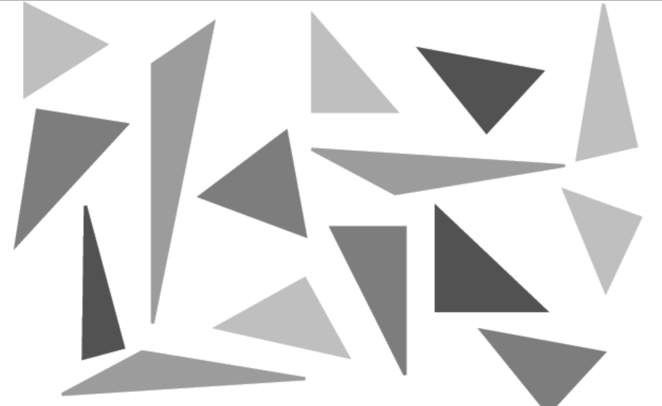
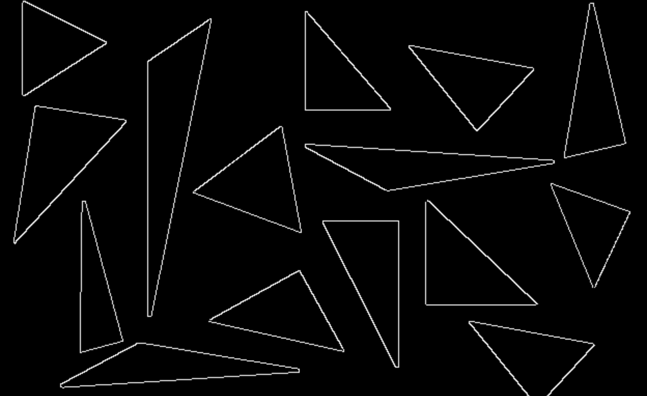
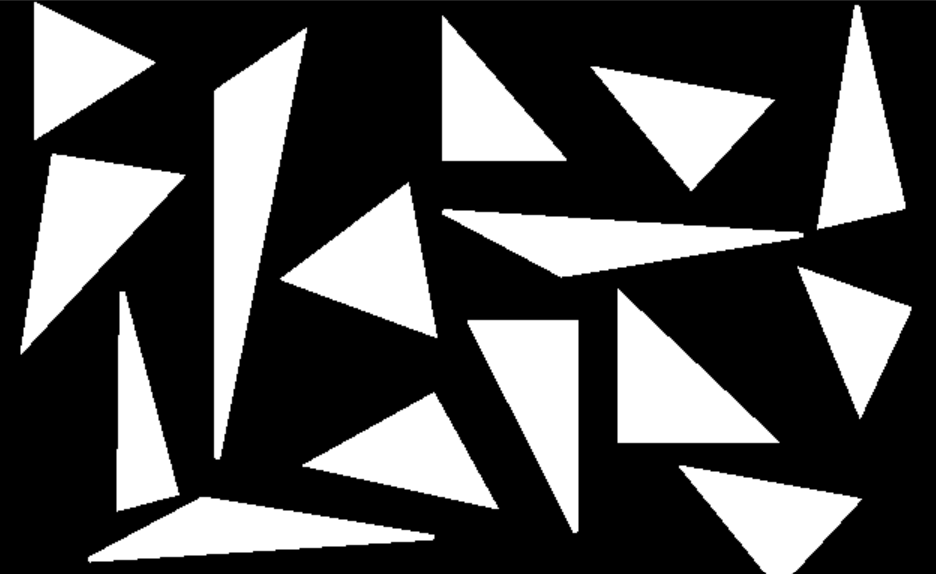
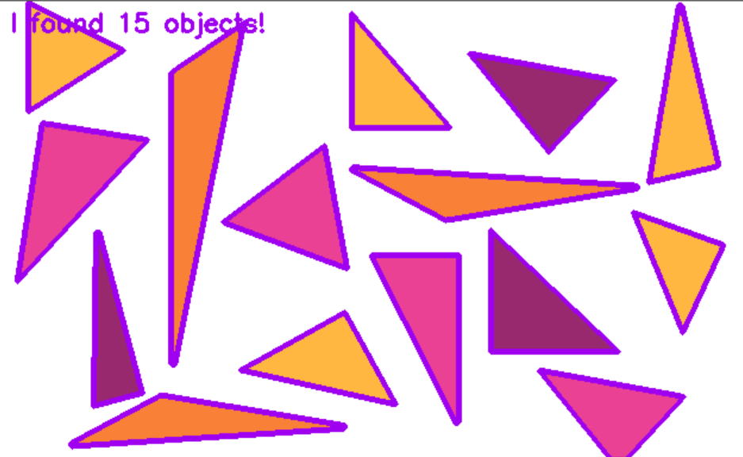
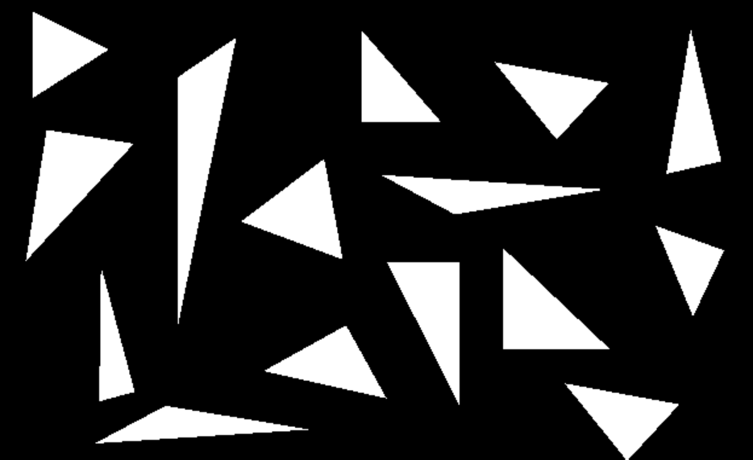
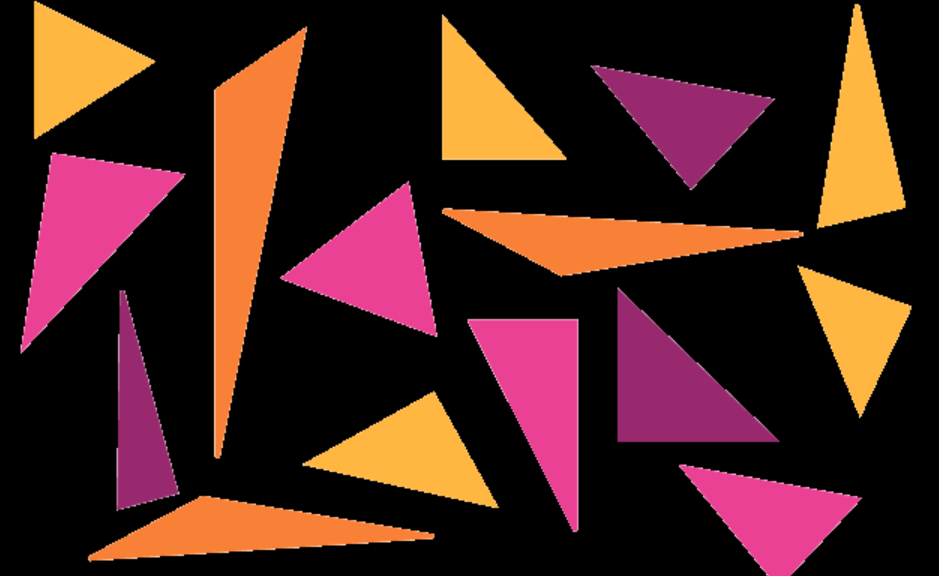

# WORK WITH IMAGES AND PYTHON CV

## OBRAZ BAZOWY

## ROI

## ZMIENIONY ROZMIAR (z pominięciem ratio-aspect)

## ROTACJA PRZYCIĘTA

## ROTACJA PRZYCIĘTA

## ROZMYTY

## NARYSOWANE KSZTAŁTY - PROSTOKĄT

## NARYSOWANE KSZTAŁTY - KOŁO

## NARYSOWANE KSZTAŁTY - LINIA

## TEKST

## SKALA SZAROŚCI

## DETEKCJA KRAWĘDZI

## TRESHOLDING

## DETEKCJA I ZAZNACZANIE KRAWĘDZI

## EROZJA PIKSELI DLA ZADANEJ ITERACJI

## MASKOWANIE

## WYKORZYSTANE FUNCKJE

cv2.imread() - funkcja zwraca obraz z załadowany z zadanej ścieżki w postaci tablicy.

image.shape - wykorzystane w celu uzyskania wysokości i głębokości obrazu,  gdzie głębokość obrazu to określenie liczby kanałów (we wskazanym przypadku 3- odpowiednio r, g , b)

cv2.waitKey(0) - kontroluje wyświetlanie okna dopóki nie zostanie kliknięty jakiś przycisk

cv2.imshow() - wyświetla okno z zadanym obrazem

image[y_from : y_to, x_from : x_to] - wydziela fragment obrazu wielkości 100x100 px, znajdujący się wewnątrz zadanych punktów

cv2.resize(image, (height, width)) - zmienia wielkość wyświetlanego obrazu na zadaną, pomija aspekt proporcjonalności

imutils.resize(image, width=x) - zmienia rozmiar obrazu zachowując automatycznie aspekt proporcjonalności

cv2.getRotationMatrix2D(center, -45, 1.0) - tworzy macierz rotacji na podstawie środka obrazu, kąta obrotu i skali

cv2.warpAffine(image, given_matrix, (w, h)) - zajmuje się właściwym obróceniem obrazu na podstawie przekazanej macierzy

imutils.rotate(image, -45) - automatycznie zajmuje się obracaniem obrazu

imutils.rotate_bound(image, 45) - w trakcie automatycznego obracania obrazu zostaje on przycięty. Ta funkcja rozwiązuje to zagadnienie (obraca obraz dbając by nie został przycięty)

cv2.GaussianBlur(image, (kernel, sigma), 0) - rozmywa obraz. Wartość kernel definiuje poziom rozmycia

cv2.rectangle(photo, (y1, x1), (y2, x2), (r, g, b), grubość_linii) - rysuje na obrazie prostokąt o zadanych wielkościach i kolorze

circle(photo, punkt_startowy, promień, (r, g, b), grubość_linii) - rysuje na obrazie okrąg o zadanych parametrach. Grubość linii może definiować wypełnienie okręgu (jeśli wartość -1 to będzie zamalowany)

cv2.line(photo, (y1, x1), (y2, x2), (r, g, b), grubość_linii) - rysuje na obrazie linię o zadanych parametrach

cv2.putText(photo, "your text in string", (start_x, start_y), cv2.FONT_TYPE, skala, (r, g, b), grubość_linii) - przedstawia na zadanym obrazie tekst o podanych parametrach

cv2.cvtColor(image, cv2.FUNCTION_TYPE) - zmienia skalę koloru obrazu na podstawie przeekazanej funkcji

cnts = cv2.findContours() - wykrywa na zadanym obrazie krawędzie na podstawie  wskazanej funkcji 

drawContours() - rysuje wykryte kontury na obrazie

erode() - redukuje szumy na obrazach i zmniejsza rozmiar obiektów na pierwszym planie

bitwise_and() - korzysta z maskowania do zmiany wartości pikseli na podstawie działania operacji AND

