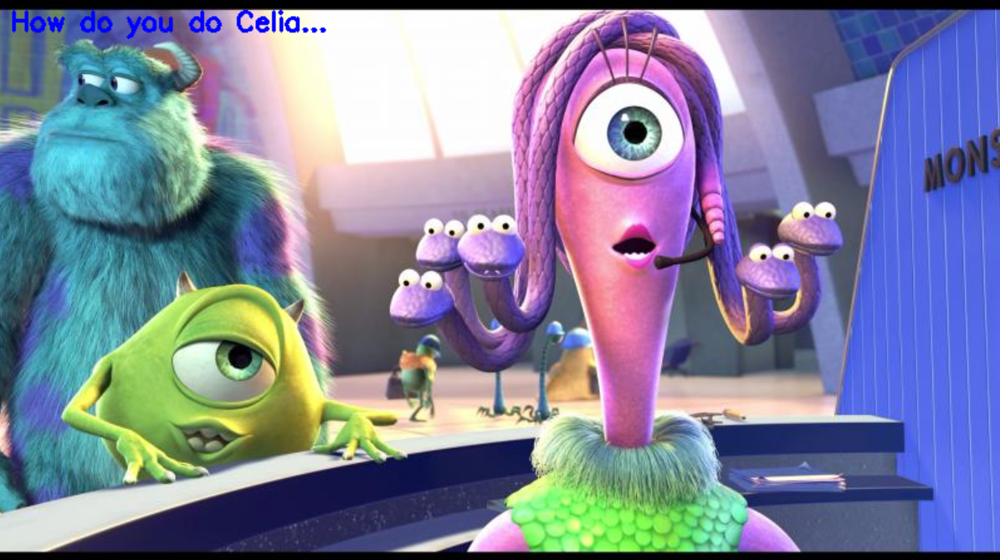

# WORK WITH IMAGES AND PYTHON CV

## OBRAZ BAZOWY

## ROI

## ZMIENIONY ROZMIAR (z pominięciem ratio-aspect)

## ROTACJA PRZYCIĘTA

## ROTACJA PRZYCIĘTA

## ROZMYTY

## NARYSOWANE KSZTAŁTY - PROSTOKĄT

## NARYSOWANE KSZTAŁTY - KOŁO

## NARYSOWANE KSZTAŁTY - LINIA  

## TEKST

